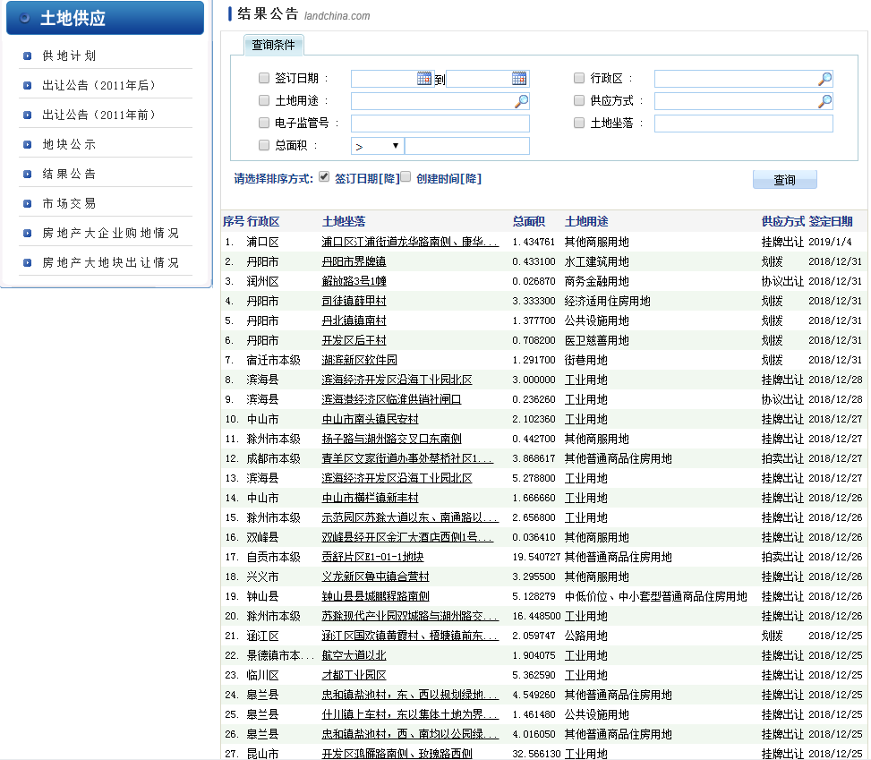
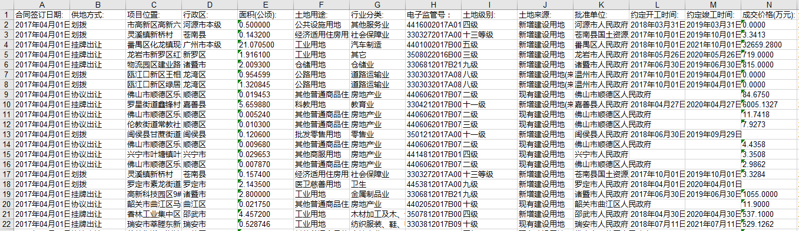

## Web_Crawler_for_www_landchina_com
自动的抓取中国土地市场网 http://www.landchina.com/  的数据，只用设置需要数据的起止时间即可！

## 主要技术
1. [Selenium （浏览器自动化测试框架）](https://baike.baidu.com/item/selenium/18266) 抓取网站数据
2. 多进程

## 更新日志
2021-03-12 输出记录增加了一列adcode（可以根据其追溯到该记录的省市区），并增加了爬取每个地区的adcode的代码

## 使用方法：
1. 安装python3
2. 安装软件依赖， 输入pip install -r requirements.txt，把包 装在自己项目的运行环境中。
4. 将谷歌浏览器驱动 文件夹中的，chromedriver.exe文件复制 粘贴到C:\Program Files (x86)\Google\Chrome\Application文件夹中ps.此驱动对应最新版本的google浏览器，请自行升级.
5. 根据爬虫任务安排文件 第一步，修改createExcel.py中的参数，运行生成表格；第二步，运行 multiprocessing-sprider.py 爬取数据；（直接运行不用改参数）
默认的参数是 starYear=2013，endYear=2015，startMonth=4，startDay=1
6. （可选）根据需要爬取adcode。在行政区选择框页面的源代码里找到省的名字及其对应id的列表，并存为json文件，名称为"originNodes.json"，然后运行 getAdcode.py (写得爬得比较慢，只是为了保险起见，感觉可以适当加快点速度)

## 效果

### 抓取目标

### 抓取结果

